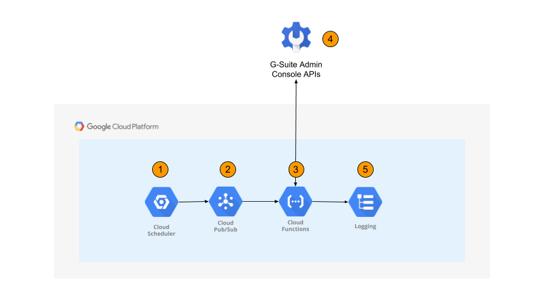

# Terraform Stackdriver Aggregated Export to PubSub

The Terraform module can be used to provision a cloudfunction which gets Gsuite Admin Logs and syncs them to stackdriver

### APIs
For the GSuite Exporter to work, the following APIs must be enabled in the project:
- Identity and Access Management API: `iam.googleapis.com`
- Admin SDK API: `admin.googleapis.com`
- PubSub API: `pubsub.googleapis.com`
- Cloud Functions API: `cloudfunctions.googleapis.com`
- Cloud Scheduler API: `cloudscheduler.googleapis.com`
- App Engine API: `appengine.googleapis.com`


## Prerequisites

See the Pypi project [documentation](https://pypi.org/project/gsuite-exporter/) for supported APIS and destinations

### Service account
We need two Terraform service accounts for this module:
* **Terraform service account** (that will create the Scheduler & Cloudfunction)
* **CloudFunction service account** (that will be used by the CloudFunction to pull logs from GSuite and write them to Stackdriver Logging)

The **Terraform service account** used to run this module must have the following IAM Roles:
- `PubSub Admin` on the project to create the pubsub
- `Storage Admin` on the project to create the storage accounts
- `Service Account User` on the project (to associate the Cloudfunction service account with the CloudFunction)
- `Cloud Scheduler Admin` on the project to create the cloud scheduler
- `CloudFunction Admin` on the project to create the cloud function.

The **CloudFunction service account** passed to this module must have :
- A GSuite Admin account
- A service account with:
  * [GSuite domain-wide delegation](https://developers.google.com/admin-sdk/reports/v1/guides/delegation) enabled.
  * The IAM roles
    - `roles/iam.serviceAccountTokenCreator` set on the organization.
    - `roles/logging.viewer` set on the project to view logs
    - `roles/logging.configWriter` set on the project to write logs to stackdriver


  * The following scopes in the [API client access page](https://admin.google.com/AdminHome?chromeless=1#OGX:ManageOauthClients)
    - https://www.googleapis.com/auth/admin.reports.audit.readonly (to read from the Reports API)
    - https://www.googleapis.com/auth/iam (to generate a super-admin token)

## Usage
The usage of the module within your own main.tf file is as follows:

```hcl
    module "gsuite-exporter" {
      source                          = github.com/terraform-google-modules/terraform-google-gsuite-export
      region                          = "us-central1"
      project_id                      = "example-project"
      name                            = "demo-cf-export"
      cs_schedule                     = "*/10 * * * *"
      gsuite_exporter_service_account = "gsuite-exporter-sa@example-project.iam.gserviceaccount.com"
      gsuite_admin_user               = "admin@example.com"
    }
```

## Inputs

| Name | Description | Type | Default | Required |
|------|-------------|:----:|:-----:|:-----:|
| gsuite_admin_user | The email of a gsuite admin user | string | - | yes |
| project_id |The ID of the project where the pub/sub topic will be installed  | string | - | yes |
| gsuite_exporter_service-account| The email address of the service account which has been added to the gsuite admin consle and has [GSuite domain-wide delegation](https://developers.google.com/admin-sdk/reports/v1/guides/delegation)  | string | - | yes |
| region | The location of resources | string | `us-central1` | no |
| name | Prefix for resource naming | string | `demo-cf-export` | no |
| cs_schedule| The Schedule which to trigger the function | string | `*/10 * * * *` | no |
| enabled_services  | The services required to be enabled | list | `see vars file` | no |
| enable_app_engine  | Boolean Variable to create App Engine App.  This is required for cloudscheduler.  If an App Engine App already exists in your project, set to false.  Otherwise set to true | Bool | `true` | no |


## Outputs

| Name | Description |
|------|-------------|


## Install

### Terraform
Be sure you have the correct Terraform version (0.11.x), you can choose the binary here:
- https://releases.hashicorp.com/terraform/

Then perform the following commands:

- `terraform init` to get the plugins
- `terraform plan` to see the infrastructure plan
- `terraform apply` to apply the infrastructure build
- `terraform destroy` to destroy the built infrastructure


## HLD

This solution uses "serverless" architecture to pull GSuite Audit Logs from the Gsuite Admin APIs.  On each run, the python application will check the timestamp of the previously sync'd logs to ensure there are no duplicate logs entries




1. Cloud Scheduler Runs at a defined interval (default is 10 minutes), sending a message to the Pub/Sub
2. The PubSub Topic Triggers the Cloudfunction and passes data to cloudfunction
3. The Cloudfunction parses the PubSub message and executes a sync between Gsuite and Stackdriver
4. The Gsuite Admin Report APIs return log data to the CloudFunction
5. The Cloudfunctions pushes the logs to stackdriver under the following logNames:
    - logName: /logs/login
    - logName: /logs/audit
    - logname: /logs/token
    - logname: /logs/drive
    - logname: /logs/mobile
